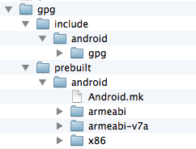

Wagon War
======

This is an experimental project developed with [Cocos2d-x 3.0](http://www.cocos2d-x.org/) and [Google Games Play Services](https://developers.google.com/games/services/).

The code of this project is licensed under MIT.

Music is copyrighted by [Matthew Pablo](http://www.matthewpablo.com/), and licensed under CC-BY 3.0

You may not use any art from this project for commercial purpose.

###Cocos2d-x

Cocos2d-x is a popular game engine for mobile devices. It has over 400,000 developers world wide, and games made with Cocos2d-x dominates top charts for iOS and Android. For more details, please visit [Cocos2d-x official website](http://www.cocos2d-x.org/).

###Google Play Games Services

The Google Play Games C++ SDK provides a C++ API for use with Google Play Games Services; Wagon War was developed with this C++ SDK. The following features are included by the game:

* Authorization

* Achievements

* Leaderboards

* Turn-based Multiplayer

###How to start the game?

Wagon War is only supported to build and run on Android deveices.

* Before you build the game , you must register a Google Play Developer Console account, and [add the game to the Google Play Developer Console](https://developers.google.com/games/services/console/enabling#step_2_add_your_game_to_the_dev_console).

* Clone the [repository](https://github.com/chukong/WagonWar.git) to your Mac.

* Download the Google Play Games Services C++ SDK from the [Downloads](https://developers.google.com/games/services/downloads) page. Then copy the /gpg-cpp-sdk/android/include/gpg/*.h to WargonWar/cocos2d/external/gpg/include/android/gpg/, copy the gpg-cpp-sdk/android/lib/gnustl/ to WargonWar/cocos2d/external/gpg/prebuilt/android/. The following image shows the library files and directory structure. 

	

* Enter the folder of *proj.android*, open the terminal and run the following command to build .so library.

		./build_native.py

* Import the Cocos2d-x project in Eclipse.

* Import the google-play-service-lib package and libcocos2dx in Eclipse as the dependent libraries of Cocos2d-x project.

* Replace your app_id, leaderboards_id and achievements_id in *proj.android/AndroidMainfest.xml* and *Classes/GPGSChecker.cpp*. Don't forget to add your Google test account to the whitelist in Google Play Developer Console.

* Complie and Run.
